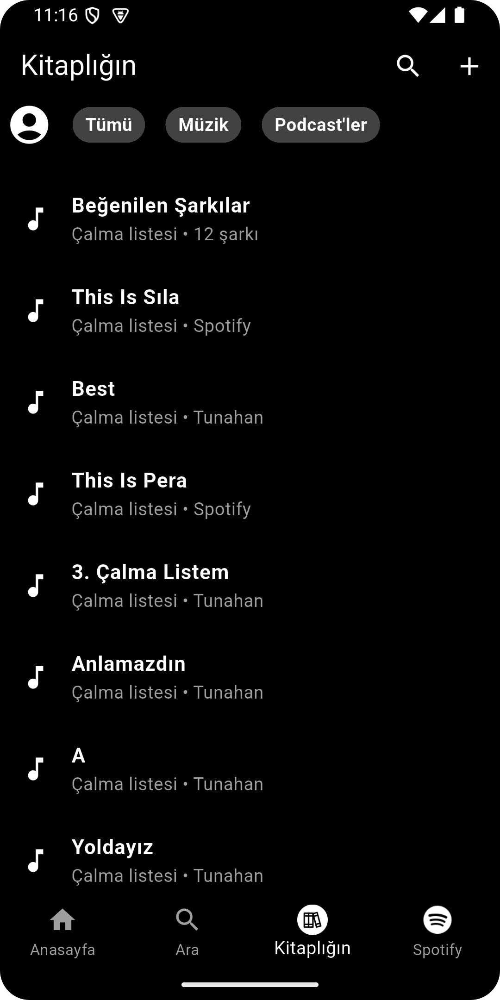
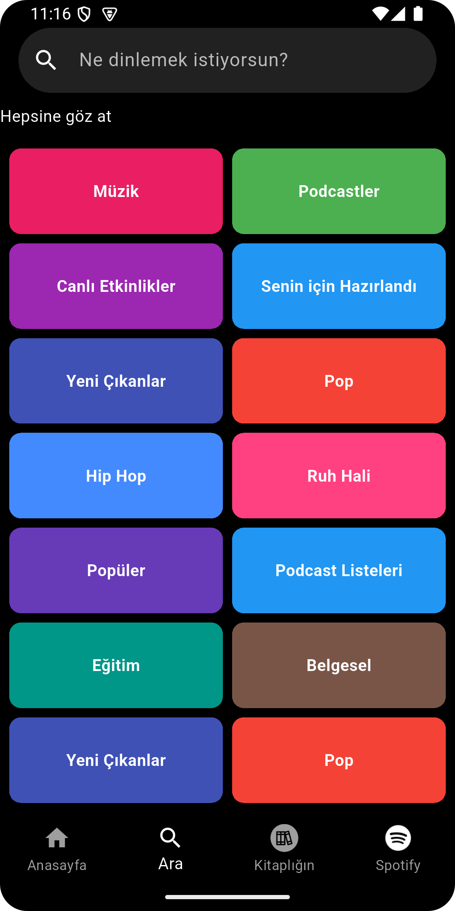
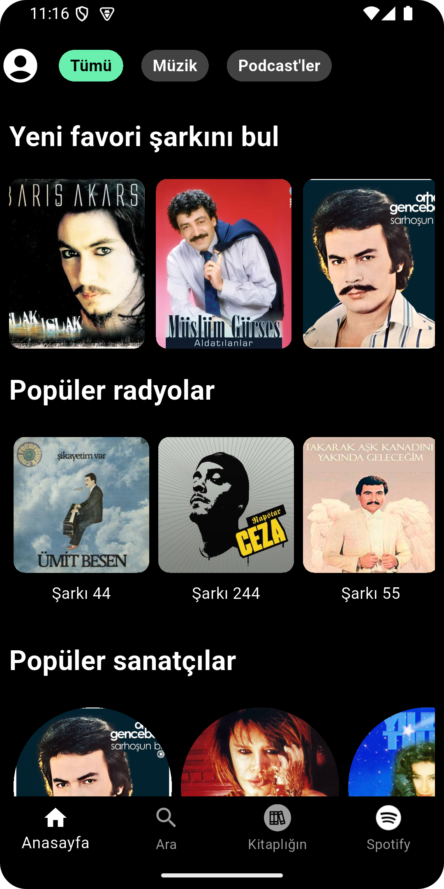
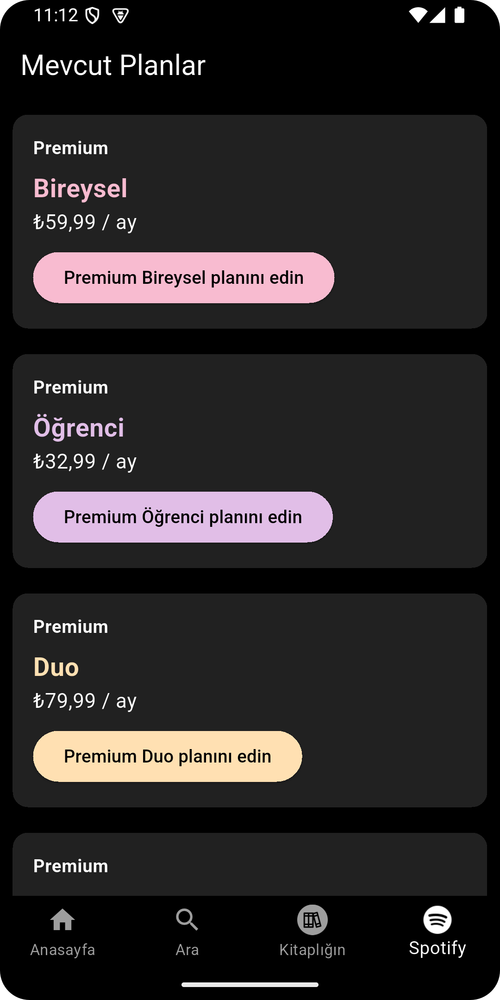

# 📱 Uygulama Adı

Bu proje, kullanıcıların müzik ve podcast içeriklerine kolayca erişmesini sağlayan bir mobil uygulamadır. Kullanıcı dostu bir arayüzle geniş bir içerik arşivine ulaşabilirsiniz.

## 🚀 Özellikler
- 🔍 **Gelişmiş Arama:** Kullanıcılar istedikleri içerikleri kolayca bulabilir.
- 📚 **Kitaplık Yönetimi:** Çalma listeleri oluşturma ve favori içerikleri kaydetme.
- 🎵 **Öneriler:** Kullanıcı zevkine göre öneriler sunma.
- 📻 **Popüler Radyolar ve Sanatçılar:** Geniş müzik ve podcast arşivi.

## 📸 Ekran Görüntüleri

<div align="center">

### Ana sayfa


### Arama sayfası


### Kitaplık sayfası


</div>


Spotify sayfası:


## 📥 Kurulum
1. Bu repository'yi klonlayın:
   ```sh
   git clone https://github.com/kullaniciadi/projeadi.git
   ```
2. Gerekli bağımlılıkları yükleyin:
   ```sh
   npm install  # veya yarn install
   ```
3. Uygulamayı başlatın:
   ```sh
   npm start  # veya expo start (React Native için)
   ```

## 📌 Kullanım
Uygulamayı açarak ana sayfadan müzik veya podcast içeriği keşfedebilir, arama yapabilir ve kendi kitaplığınızı yönetebilirsiniz.

## 📄 Lisans
Bu proje [Lisans Türü] altında lisanslanmıştır. Daha fazla bilgi için `LICENSE` dosyasına göz atabilirsiniz.

